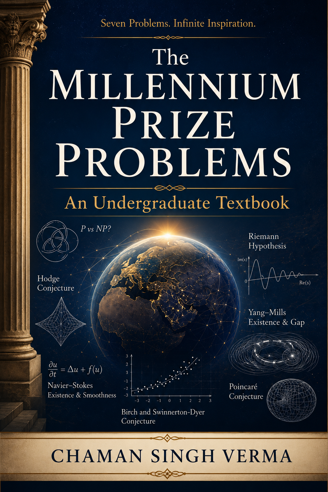

<p align="center">
  
</p>

<h1 align="center">The Millennium Prize Problems</h1>

<p align="center">
  <em>A Textbook for Undergraduate Students</em>
</p>

<p align="center">
  <a href="#chapters">Chapters</a> &bull;
  <a href="#appendices">Appendices</a> &bull;
  <a href="#building">Building</a> &bull;
  <a href="#prerequisites">Prerequisites</a> &bull;
  <a href="#license">License</a>
</p>

---

A comprehensive, self-contained textbook covering all seven [Millennium Prize Problems](https://www.claymath.org/millennium-problems) announced by the [Clay Mathematics Institute](https://www.claymath.org/) in 2000. Each problem carries a \$1,000,000 prize for its solution. As of 2026, only the Poincare Conjecture has been resolved.

## Audience

Undergraduate students of mathematics, physics, computer science, and related fields who have completed calculus, linear algebra, and basic abstract algebra. Suitable for a one-semester topics course or independent study.

## Features

- **Self-contained development** — each chapter builds the necessary background from scratch
- **Rigorous yet accessible** — proofs are complete but written with the undergraduate reader in mind
- **Historical context** — each problem is placed in its mathematical and historical setting
- **Pedagogical tools** — Key Ideas summaries, worked examples, "Check Your Understanding" questions, and exercises with selected solutions

## Chapters

### Part I: The Solved Problem

| | Chapter | Topic |
|---|---------|-------|
| 1 | [The Poincare Conjecture](chapters/ch01_poincare.tex) | Manifolds, fundamental group, Ricci flow, Perelman's proof |

### Part II: The Open Problems

| | Chapter | Topic |
|---|---------|-------|
| 2 | [The Riemann Hypothesis](chapters/ch02_riemann.tex) | Riemann zeta function, distribution of primes, critical line |
| 3 | [P Versus NP](chapters/ch03_pvsnp.tex) | Computational complexity, NP-completeness, Cook-Levin theorem |
| 4 | [The Navier--Stokes Equations](chapters/ch04_navierstokes.tex) | Fluid dynamics, existence and smoothness, turbulence |
| 5 | [Yang--Mills Theory and the Mass Gap](chapters/ch05_yangmills.tex) | Gauge theory, QCD, confinement, lattice methods |
| 6 | [The Hodge Conjecture](chapters/ch06_hodge.tex) | Algebraic cycles, cohomology, Lefschetz theorem |
| 7 | [The Birch and Swinnerton-Dyer Conjecture](chapters/ch07_birch.tex) | Elliptic curves, L-functions, rank, Mordell-Weil theorem |

## Appendices

| Appendix | Description |
|----------|-------------|
| [Mathematical Preliminaries](appendices/appendix_prerequisites.tex) | Review of set theory, algebra, topology, analysis, and geometry |
| [Notation Index](appendices/appendix_notation.tex) | Comprehensive reference of all symbols used throughout the book |
| [Biographical Sketches](appendices/appendix_biographies.tex) | Short biographies of key mathematicians |
| [Glossary of Terms](appendices/appendix_glossary.tex) | Alphabetical glossary of 36 key terms |
| [Exercises and Problems](appendices/appendix_problems.tex) | Chapter-by-chapter review exercises with hints and solutions |

## Building

### Requirements

- A TeX distribution ([TeX Live](https://tug.org/texlive/) or [MacTeX](https://tug.org/mactex/))

### Using latexmk (recommended)

```bash
latexmk -pdf millennium_prizes
```

### Using pdflatex manually

```bash
pdflatex millennium_prizes
makeindex millennium_prizes
pdflatex millennium_prizes
pdflatex millennium_prizes
```

## Project Structure

```
MillenniumPrize/
├── millennium_prizes.tex          # Main document
├── millennium_prizes.pdf          # Compiled output
├── frontpage.png                  # Cover image
├── chapters/
│   ├── ch01_poincare.tex
│   ├── ch02_riemann.tex
│   ├── ch03_pvsnp.tex
│   ├── ch04_navierstokes.tex
│   ├── ch05_yangmills.tex
│   ├── ch06_hodge.tex
│   └── ch07_birch.tex
└── appendices/
    ├── appendix_prerequisites.tex
    ├── appendix_notation.tex
    ├── appendix_biographies.tex
    ├── appendix_glossary.tex
    └── appendix_problems.tex
```

## References

The bibliography includes 29 references spanning the primary literature for each problem, standard graduate textbooks, and historical sources. See the compiled PDF for the full list.

## License

This project does not currently include a license. Contact the author for usage permissions.
